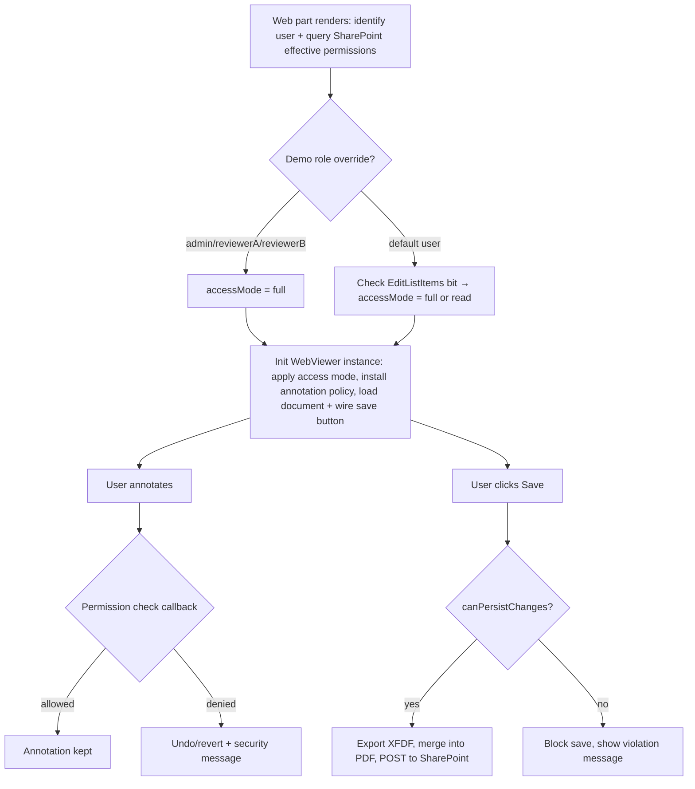

# WebViewer Annotation RBAC + SharePoint Permissions — Workflow

High-level workflow for how the `sharepoint-web-part` sample combines SharePoint's own
permission system with WebViewer's annotation permission APIs to control who can view,
annotate, and save documents.

Reference implementation: [WebviewerWebPart.ts](../sharepoint-web-part/src/webparts/webviewer/WebviewerWebPart.ts)

## Flow diagram

## Step 1 — Render: identify user + resolve SharePoint permission

**Trigger:** `WebviewerWebPart.render()`

| Concern | API / Class | Notes |
|---|---|---|
| Get current SharePoint user identity | `this.context.pageContext.user` (SPFx `PageContext`) | Provides `displayName`, `email`, `loginName` without needing Graph calls. |
| Normalize identity for comparisons | `_normalizeIdentity()` (custom helper) | Lowercases and strips claims prefix (`i:0#.f|membership|...`). |
| Demo role override lookup | `_resolveDemoUserRole()` (custom) | Hardcoded email matches (`admin`, `reviewerA`, `reviewerB`) for the security demo. Falls through to `'default'` for real users. |
| Query SharePoint's effective permission on the specific file | `fetch(".../_api/web/GetFileByServerRelativePath(...)/ListItemAllFields/effectiveBasePermissions")` | SharePoint REST API. Returns `EffectiveBasePermissions.High/Low` bitmask. |
| Decide edit vs. read-only | `_canEditListItems()` (custom) — checks the `EditListItems` (`4`) bit against `Low` | This is the actual SharePoint permission → WebViewer mode mapping. |

**Output:** `_accessMode` (`'full'` or `'read'`), `_canPersistChanges` (boolean), `_demoUserRole`.

## Step 2 — Initialize WebViewer: apply access mode, install annotation policy, load document

**Trigger:** `WebViewer(...).then(instance => { ... })`

| Concern | API / Class | Notes |
|---|---|---|
| Create the WebViewer instance | `WebViewer()` constructor (`@pdftron/webviewer`) | Loads runtime from the SharePoint-hosted static assets path. |
| Disable blob-URL PDF workers (SPO CSP) | `disableObjectURLBlobs: true` (constructor option) | Required because SharePoint Online's CSP blocks `script-src blob:`. |
| Disable embedded JS (SPO CSP) | `instance.Core.disableEmbeddedJavaScript()` | Blocks AcroForm inline-script iframes, which SPO's CSP would block anyway. |
| Set current user for mentions/authoring | `instance.UI.mentions.setUserData()`, `instance.Core.annotationManager.setCurrentUser()` | Ties WebViewer's annotation author metadata to the SharePoint identity. |
| Apply read-only vs. full mode | `_applyAccessMode()` → `instance.UI.enableViewOnlyMode()`, `instance.UI.disableElements(['saveFileButton'])`, or `_createSaveFileButton()` | Gate driven entirely by the SharePoint permission resolved in Step 1. |
| Install the annotation permission policy | `_installAnnotationPermissionPolicy()` → `instance.Core.annotationManager.setPermissionCheckCallback()` | Central authorization hook — see Step 3. |
| Install read-only guard (read mode only) | `_installReadOnlyAnnotationGuard()` → `updateAnnotationPermission` + `annotationChanged` listeners | Marks all annotations `ReadOnly = true` and reverts any attempted change. |
| Load the actual file | `instance.UI.loadDocument(initialDocUrl, { filename })` | `initialDocUrl` points at `_api/web/GetFileByServerRelativePath(...)/$value` — streams the file through SharePoint's own auth, no separate token needed. |
| Welcome / mode messaging | `instance.UI.showWarningMessage()` (via `_showWelcomeMessageAfterDocumentLoad`) | Cosmetic — tells the user what role/mode they're in. |

## Step 3 — Annotate: permission check callback

**Trigger:** Any annotation create/modify/delete in WebViewer's `AnnotationManager`.

| Concern | API / Class | Notes |
|---|---|---|
| Authorize each annotation mutation | `Core.AnnotationManager.setPermissionCheckCallback((author, annotation) => boolean)` | Returns `true`/`false` per annotation. Demo logic: `admin` → always allowed; read mode → always denied; `reviewerB` → always allowed (intentionally, to demo the *revert* flow below); default → author must match current user. |
| Detect unauthorized changes after the fact | `annotationManager.addEventListener('annotationChanged', (annotations, action, info) => ...)` | Used for the "detect + revert" security demo (`reviewerB`) and for the real ownership-violation check (default users editing someone else's annotation). |
| Revert an unauthorized change | `Core.DocumentViewer.getAnnotationHistoryManager().undo()`, or `annotationManager.importAnnotations(baselineXfdf)` as fallback | `annotationHistoryManager` is captured via `documentViewer.getAnnotationHistoryManager()`. |
| Baseline snapshot for revert fallback | `annotationManager.exportAnnotations()` (XFDF) | Re-captured after every legitimate change so the "last known good" state stays current. |
| Notify the user of the block | `instance.UI.displayErrorMessage()` / custom modal via `_showMessage()` | Custom modal built with `instance.UI.addCustomModal()`. |

## Step 4 — Save: persist back to SharePoint

**Trigger:** Custom "Save" header button (`_createSaveFileButton`).

| Concern | API / Class | Notes |
|---|---|---|
| Final authorization gate before any network call | `this._canPersistChanges` (from Step 1) | Checked again at save time, independent of the annotation-level checks — this is the real SharePoint `EditListItems` permission, not just the demo annotation policy. |
| Export current annotations as XFDF | `instance.Core.annotationManager.exportAnnotations()` | |
| Merge annotations into the PDF binary | `instance.Core.documentViewer.getDocument().getFileData({ xfdfString })` | Produces the final `ArrayBuffer` to upload. |
| Get a SharePoint anti-forgery token | `fetch("_api/contextinfo")` → `GetContextWebInformation.FormDigestValue` | Required as `X-RequestDigest` header for the write call. |
| Upload/overwrite the file | `fetch("_api/web/GetFolderByServerRelativePath(...)/Files/add(url=..., overwrite=true)")` (`POST`) | Standard SharePoint REST file-upload API — SharePoint's own permission system (`EditListItems`/`Contribute`) is the real enforcement point here; a user without write access gets an HTTP failure even if the client-side gate were bypassed. |
| Success / failure UI | `instance.UI.openElements(['savedModal'])` / `_showMessage()` | |

## Key takeaway

SharePoint's own permission system (`effectiveBasePermissions`, `EditListItems` bit) is the
**source of truth** for whether a user can edit or save at all. WebViewer's
`setPermissionCheckCallback` and `annotationChanged` listeners are a **second, client-side
layer** used to enforce finer-grained rules (e.g., "you can only edit your own annotations")
that SharePoint's coarse-grained list permissions don't express — but the actual save-back
to SharePoint is still gated by real SharePoint permissions on the underlying REST call, so
the client-side checks can never grant more access than SharePoint itself allows.
